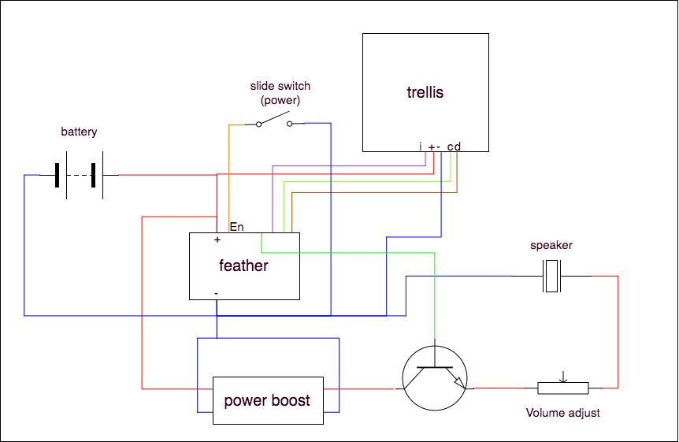

# Trellis sound box

This is a sound board project I'm designing for my daughter.

## Wiring diagram

## Parts List

Note that most of these parts are big packs parts (e.g. 100 piece packs) and theoretically some of it you may have already.

*   Adafruit Trinket M0
    *   https://www.adafruit.com/product/3500
    *   8.95
*   Adafruit Trellis PCB
    *   https://www.adafruit.com/product/1616
    *   9.95
*   Adafruit Trellis Elastomer Button Keypad
    *   https://www.adafruit.com/product/1611
    *   4.95
*   6 3mm square nuts
    *   https://www.amazon.com/gp/product/B018JPZNS6/ref=oh_aui_detailpage_o00_s00?ie=UTF8&psc=1
    *   6.99 for a pack of 100
*   2 3mm x 12 mm machine screws
    *   https://www.mcmaster.com/#catalog/124/3085/=1bxemok
    *   2.72 for a pack of 100
*   4 3mm x 8mm machine screws
    *   https://www.mcmaster.com/#catalog/124/3085/=1bxenvz
    *   2.72 for a pack of 100
*   2 5 pin JST-XHP JST connectors with 2.54 mm female pin headers
    *   https://www.amazon.com/gp/product/B01MCZE2HM/ref=oh_aui_detailpage_o02_s00?ie=UTF8&psc=1
    *   10 for a 460 piece kit
*   2 2 pin JST-XHP JST connectors with 2.54 mm female pin headers
    *   https://www.amazon.com/gp/product/B01MCZE2HM/ref=oh_aui_detailpage_o02_s00?ie=UTF8&psc=1
    *   You can get them from the same kit above
*   JST crimpers that work for 2.54 pins
    *   https://www.amazon.com/gp/product/B00OMM4YUY/ref=oh_aui_detailpage_o02_s01?ie=UTF8&psc=1
    *   22
*   22 gauge stranded cable
    *   https://www.amazon.com/gp/product/B00B4ZQ3L0/ref=oh_aui_detailpage_o03_s00?ie=UTF8&psc=1
    *   20 for a box of assorted colors
*   AAA battery pack for 3 batteries
    *   https://www.amazon.com/gp/product/B01GVDGA5S/ref=oh_aui_detailpage_o03_s00?ie=UTF8&psc=1
    *   7.49 for a pack of 6
*   28 mm 1watt 8 ohm speakers
    *   https://www.amazon.com/gp/product/B019JMV0JY/ref=oh_aui_detailpage_o05_s00?ie=UTF8&psc=1
    *   8.49 for a pack of 4
*   LM2577 Mico USB DC Voltage Regulator Step Up Boost Converter Power Supply
    *   https://www.amazon.com/gp/product/B075R8H1K9/ref=oh_aui_detailpage_o06_s00?ie=UTF8&psc=1
    *   7.99 for a pack of 10
*   HELLOYEE 10K Ohm Breadboard Trim Potentiometer With Knob
    *   https://www.amazon.com/gp/product/B01IK6GT1E/ref=oh_aui_detailpage_o07_s00?ie=UTF8&psc=1
    *   9.99 for a pack of 10
*   Teenitor 100 Pack SS-12D00G3 High Knob 3P 2 Position 1P2T SPDT Vertical Slide Switch
    *   https://www.amazon.com/gp/product/B01MXIVDCT/ref=oh_aui_detailpage_o03_s00?ie=UTF8&psc=1
    *   8 for a pack of 100
*   16 3mm LEDs
    *   https://www.amazon.com/gp/product/B01N0XRH5R/ref=oh_aui_detailpage_o02_s00?ie=UTF8&psc=1
    *   8.49 for a pack of 160
*   Paper perf board (optional)
    *   https://www.amazon.com/gp/product/B072Q1H6GX/ref=oh_aui_detailpage_o05_s01?ie=UTF8&psc=1
    *   9.50 for a pack of 20
*   2.5mm x 8mm self tapping screws
    *   https://www.amazon.com/gp/product/B071DWY1Z5/ref=oh_aui_detailpage_o09_s00?ie=UTF8&psc=1
    *   4.99 for a pack of 50
*   3 Tripple A batteries
*   Adafruit perma-proto half sized board
    *   https://www.adafruit.com/product/571
    *   12.50
